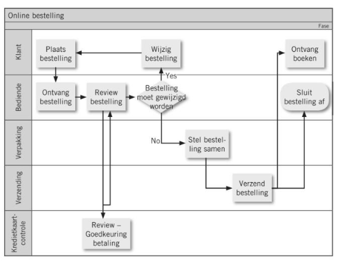

<h1>Process requirements opstellen</h1>

# Opstellen van process requirements

Process requirement = vereisten van een bedrijfsproces t.a.v. een ondersteunende digitale oplossing.

-> Moeten uitgeschreven worden om mogelijke optimalisaties te identificeren.

Digitale tools zijn meestal geen kernactiviteiten, hun doel is de bedrijfsprocessen efficiënter te maken.

# Rollen in het opstellen van process requirements

- Business analist: Maakt de procesbeschrijving op en formuleert adviezen voor verbetering. Interviewt gebruikers.
- Process owner: Is verantwoordelijk voor een proces / subproces en geeft daar de initiële input over. Neemt eindbeslissingen bij wijzigingen.
- Eindgebruikers: Voeren de taken uit in het proces. Kunnen meer details geven over het proces dan de process owner. (vooral door verschillen in taakbeschrijving - realiteit)

# Process flowchart

= deliverable van deze fase.

- Beschrijft de verschillende stappen van een project.
- Beschrijft welke gegevens doorgegeven worden.
- Beschrijft welke output gegenereerd wordt.
- Toont dependencies
- Geeft verschillende rollen weer (in swimlanes)

Let op! Dit is voorbereidend werk. De process flowchart wordt verder uitgewerkt tijdens het project.

# Niveaus van bedrijfsprocessen

Process flowcharts opzetten kan complex zijn, daarom maken we gebruik van niveaus.

1. Ondernemingsprocessen: Grote processen (vb. productie, sales, warehousing)
2. Afdelingsprocessen: Processen per afdeling (vb. binnen sales: bestelling, facturatie)
3. Deelprocessen (vb. binnen bestelling: bestelbon opmaken, bestelling klaarmaken, bestelling verzenden)
4. Taken: Acties en rollen die nodig zijn om de deelprocessen uit te voeren.

# Voordelen

Het opstellen van de process requirements heeft veel voordelen. Het werkt als input voor:

- De business case: Het is belangrijk om de winst van digitalisering te gaan bepalen -> zeker bij externen die betaald moeten worden (ROI). De ROI wordt vooral bepaald door de business case. De business case bepaalt ook of projecten mogen doorgaan of niet.
- Het analysedocument: kan a.d.h.v. process requirements gevalideerd worden om veranderingen te identificeren. Dit document helpt de flow duidelijk te maken aan devs. (voordeel = minder input van key users nodig)
- De testfase: Testscenario's kunnen gebaseerd worden op de business flow. Indien met swimlanes gewerkt -> ook duidelijk terug te vinden wat automatisch gebeurt / waar nog input nodig is. Vermijden dat er delen van het proces gemist worden.
- Change management: Swimlanes tonen duidelijk wie welke rollen zullen uitvoeren in de vernieuwde processen. -> Process requirements kunnen vergeleken worden met huidige processen om te kijken waar veranderingen doorgevoerd moeten worden. Tijdig inspelen op wijzigingen verlaagt weerstand bij personeel.

# Aandachtspunten

Het gaat soms wel eens mis tijdens het opstellen van process requirements.

- Zorg dat er genoeg tijd voorzien wordt -> Welke taken er zijn is niet altijd duidelijk + er zijn veel mensen bij betrokken.
- Betrek de juiste gebruikers: De luidste gebruikers zijn meestal de ontevreden gebruikers, vergeet de rest niet.
- Hou de procesbeschrijvingen eenvoudig: Moet leesbaar zijn voor alle deelnemers.
- Houd rekening met de vervaldatum: Processen veranderen snel, dus je process flowchart is maar voor beperkte tijd accuraat.
