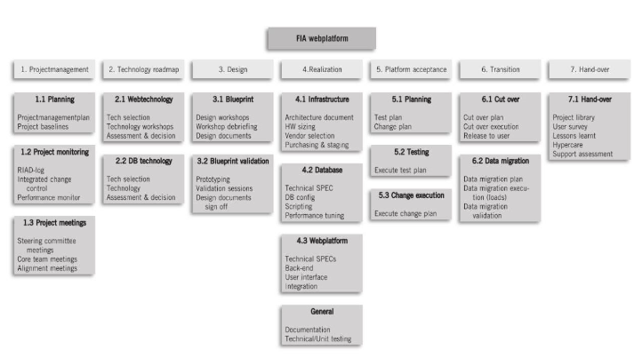

<h1>Planningfase</h1>

# Planning

Projectplanning is een verzameling van tools en documenten om het verloop van het project voor te stellen, op te volgen en bij te sturen.

# Doel

Definitieve invulling van het projectteam: De detailplanning is nodig om de invulling te kunnen doen. Je kiest hier het core team + ondersteuners. De planning is ook nodig om praktische details uit te werken: Hoe gaan we internationaal werken? Welk materiaal heeft iedereen nodig?

Projectmanager -> coördinerende rol

Timing: Niet enkel sequentieel, soms ook parallel. Probeer wachttijden te beperken. (Hou rekening met dependencies)

# Rollen

- Projectmanager: coördinatie en uitwerken van realiseerbare planning met juiste verwachtingen.
- Sponsor: Stelt resources ter beschikking
- Business analist / technische experts: Helpen met de inschatting van de planning

# Deliverables

## Kick-off meeting

Voorstel van de projectplanning + praktische afspraken aan alle teamleden.

Teamleden leren kennen -> inzet op vlotte samenwerking

## Projectplan

Is volledig klaar tegen deze fase.

Bij iteratieve projecten wordt het projectplan wel nog aangevuld per iteratie.

## Work Breakdown Structure

Een WBS is een hiërarchische voorstelling van de deliverables die in het project moeten aangeleverd worden. De pakketten worden geschat qua tijd en verdeeld.

-> Is input voor de planning en wordt opgesteld door de projectmanager

Note:

- WBS wordt vaak al een eerste keer opgesteld in de <a href="./H6.md">conceptfase</a>.
- WBS bevat geen volgorde of dependencies
- Kan gebruikt worden voor tijdsregistratie.

# Planningsmethodes

Gegevensverzameling wordt meestal aangepakt volgens <abbr link="Result Oriented Modelling">ROM</abbr>

1. Start met de doelen + subdoelen
2. Schat de tijdsduur voor de activiteiten in
3. Stel dependencies vast
4. Bedenk wie verantwoordelijk is
5. Bedenk welke middelen nodig zijn.

Daarna analyseer je de gegevens en maak je een netwerkplanning.

## Network diagram

Flowchart waarin je de volgorde van activiteiten kan vaststellen. De dependencies zijn er duidelijk in aangegeven.

Binnen je netwerkplanning moet je het kritieke pad bepalen. **(LES BEKIJKEN)**
Op basis van de dependencies kan je ook slack time bepalen. **(LES BEKIJKEN)**

Op basis van de informatie in je network diagram stel je de GANTT-chart op.

## GANTT-chart / Strokenplanning
