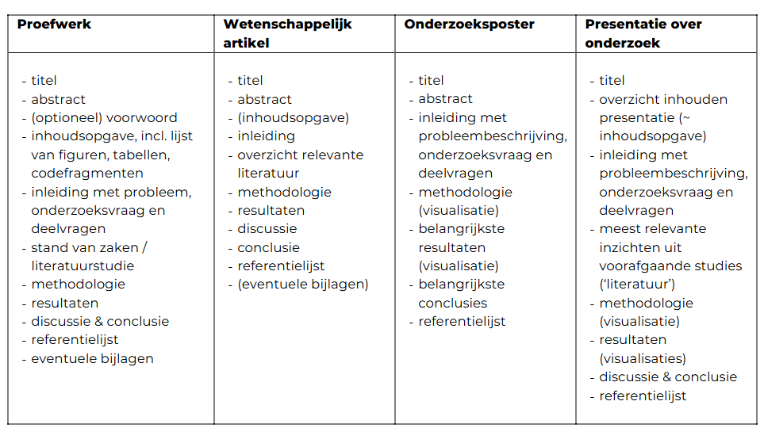

# Fasen van groepsopdracht

- Brainstormen over mogelijke onderwerpen.
- Eerste informatie opzoeken
- Onderwerpen bijstellen / verfijnen / afbakenen -> je moet erachter komen of het probleem niet al opgelost is
- Hoofdonderzoekvraag formuleren
- Deelvragen over het probleem en een mogelijke oplossing opstellen
- Deelvragen bijstellen op basis van onderzoek
- Stappenplan uitwerken van methodologie om deelvragen op te lossen.
- Schriftelijke neerslag voorbereiden: referentielijst in orde brengen

# Opbouw van wetenschappelijke teksten

- Abstract:
- Inleiding:
- Hoofdstuk over inzichten:
- Info over werkwijze:
- Resultaten:
- Bespreking van wat de resultaten betekenen
- Bronnenlijst

Daarnaast ook: Inhoudstafel, lijst van tabellen / figuren / afkortingen, codefragmenten.

## Poster

Bevat ook een titel, abstract, inleiding met probleembeschrijving en onderzoeksvragen.

Dezelfde informatie als in een geschreven onderzoekstekst, maar vooral visuaal (grafieken, etc.)

# Richtlijnen

## Titel

- Geen vraag
- Kort en krachtig, maar onderzoeksvraag moet eruit afgeleid kunnen worden.
- Passende kernwoorden
- Vermijd vakjargon

## Abstract

Meestal één alinea. Voor een BAP - max 1 pagina.

## Inhoudsopgave

Maximaal 4 niveaus diep (1.1.1.1)

**Volgorde**:  
Inhoudsopgave -> Lijst van figuren -> Lijst van tabellen -> Lijst van codefragmenten -> Lijst van afkortingen (alfabetisch)

## Inleiding

Als volgt opgebouwd:

- Waarover gaat het onderzoek? Waarover gaat het niet? (omvang duidelijk maken)
- Relevantie van het onderzoek.
- Onderzoeksvraag verduidelijken (expliciet) + deelvragen expliciet vermelden.
- Doel van het onderzoek aangeven.
- Hoe zit de rest van het werk in elkaar? (vaak in combinatie met methodologie)

Deelvragen gaan over ofwel het probleemdomein (helpen het probleem te begrijpen) of het oplossingsdomein (helpen dichter te komen bij een oplossing).

## Hoofdtekst

Noodzakelijke hoofdstukken:

- literatuurstudie
- methodologie
- resultaten (eerst objectieve beschrijving, daarna interpretatie - soms hoort dit laatste bij conclusie)

Elk hoofdstuk moet op zichzelf weer bestaan uit een IMS-structuur.

### Tips methodologie

Beschrijf zeker:

- Wie deelnam aan het onderzoek (indien relevant).
- Welke stappen werden er uitgevoerd?
- Hoe werden de stappen uitgevoerd? (tools, volgorde, etc.)
- Wat waren de variabelen, constanten, voorwaarden, etc.

Handig om deze visueel weer te geven.

## Conclusie

Gaat soms samen met de discussie van de resultaten.

- Discussie = interpretatie van de resultaten
- Conclusie = koppeling van de interpretatie aan het volledige werk.

In de conclusie worden volgende vragen behandeld:

- Wat is het antwoord op de onderzoeksvraag?
- Kunnen de resultaten veralgemeend worden?
- Wat zijn de beperkingen van het onderzoek?
- Welk vervolgonderzoek is nodig?
