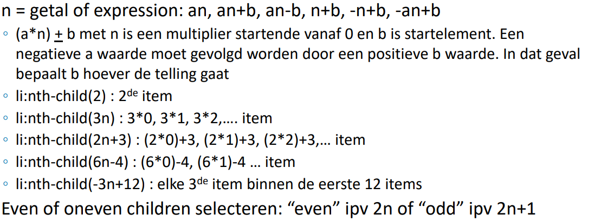
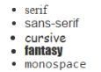
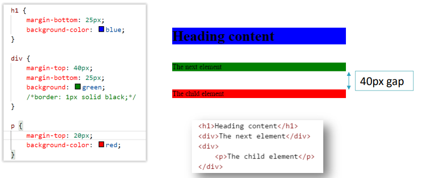
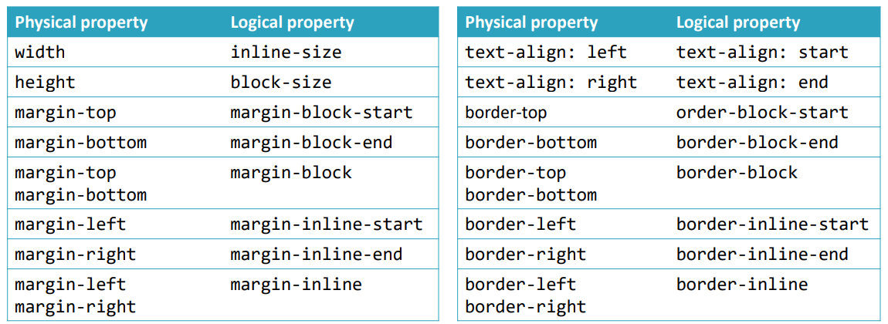
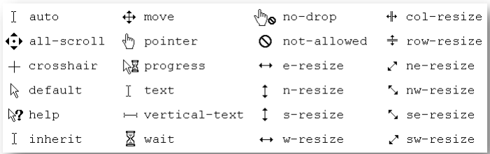
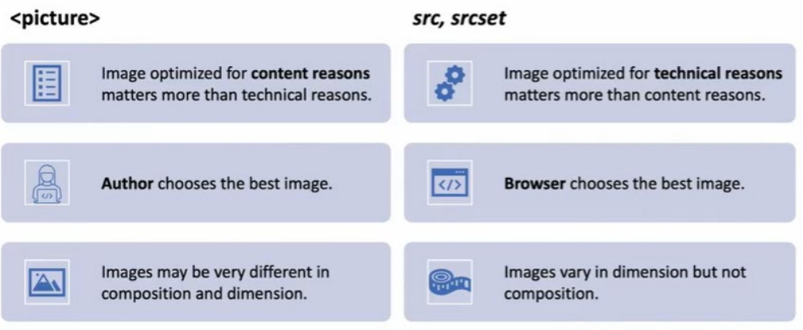

<h1> NOTITIES </h1>

- [Algemene conventies](#algemene-conventies)
  - [Mappen en bestanden](#mappen-en-bestanden)
- [HTML](#html)
  - [Cheatsheet](#cheatsheet)
    - [Generic](#generic)
    - [Block elements](#block-elements)
    - [Inline elementen](#inline-elementen)
    - [Tabellen](#tabellen)
    - [Formulieren](#formulieren)
    - [Speciale karakters](#speciale-karakters)
    - [Paginastructuur](#paginastructuur)
  - [Handige info](#handige-info)
    - [Globale attributen](#globale-attributen)
    - [Organisaties](#organisaties)
    - [Link elementen](#link-elementen)
      - [Speciale hyperlinks](#speciale-hyperlinks)
    - [Afbeeldingen](#afbeeldingen)
  - [Termen](#termen)
- [CSS](#css)
  - [Termen](#termen-1)
  - [Cascade en inheritance](#cascade-en-inheritance)
    - [Hoe de browser CSS verwerkt](#hoe-de-browser-css-verwerkt)
  - [Properties](#properties)
    - [Tekst](#tekst)
  - [Selectors](#selectors)
  - [Handige info](#handige-info-1)
    - [Shorthands](#shorthands)
    - [Achtergronden](#achtergronden)
    - [Lettertype](#lettertype)
  - [Box model](#box-model)
  - [Cursors](#cursors)
  - [Flex](#flex)
  - [Grid](#grid)
  - [Floating elements (vlotten)](#floating-elements-vlotten)
  - [Position](#position)
  - [Responsive lay-outs](#responsive-lay-outs)
    - [Media queries](#media-queries)
      - [Best practices](#best-practices)
    - [Responsive images](#responsive-images)
      - [Formaten](#formaten)
      - [Pixels](#pixels)
      - [Verschillende afbeeldingen weergeven](#verschillende-afbeeldingen-weergeven)
- [Visual Studio Code tips](#visual-studio-code-tips)
  - [Hotkeys](#hotkeys)
  - [HTML-specifiek](#html-specifiek)
- [Interessante links](#interessante-links)
  - [CSS](#css-1)

# Algemene conventies

## Mappen en bestanden

Naamgeving:

- kleine letters -> Linux-paden zijn case-sensitive
- \- of \_ in plaats van spaties (Google raadt - aan => optimaal voor zoekrobot van Google)
- geen speciale karakters (sommige niet toegestaan, andere krijgen andere betekenis)

Structuur:

Opdelen in folders (liefst namen van één woord). Bij kleinere websites alle HTML-bestanden in de root. Bij grotere websites meestal een folder per menu-itum dat subpagina's bevat.
**De subfolders zijn te zien in de URL-structuur**

index.html altijd in de root

Resources in aparte mappen -> zoals "images", "css", "styles". Kan soms nog samen in een map "assets"

# HTML

## Cheatsheet

Reference voor alle HTML-elementen: https://developer.mozilla.org/en-US/docs/Web/HTML

### Generic

| Elementnaam                   | Tag                                                        | Opmerking    |
| ----------------------------- | ---------------------------------------------------------- | ------------ |
| Hyperlink                     | `<a href="link">`                                          |
| Afbeelding                    | ``                | void element |
| CSS Link                      | `<link rel="stylesheet" href="path">`                      |
| favicon voor pagina instellen | `<link rel="icon" href="favicon.ico" type="image/x-icon">` |

### Block elements

Algemeen element (als er geen specifieker bestaat): `<div>`

Nemen de volledige width in. Je kan de width en height instellen via CSS.

| Elementnaam                   | Tag             | Opmerking                            |
| ----------------------------- | --------------- | ------------------------------------ |
| Description / Definition list | `<dl>`          |
| Description Term              | `<dt>`          | Term in dl                           |
| Description Details           | `<dd>`          | Beschrijving in dl                   |
| Ordered list                  | `<ol type="i">` | type = i voor Roman numerals         |
| Lange citaten                 | `<blockquote>`  |
| Figuur met bijschrift         | `<figure>`      |
| Bijschrift bij figuur         | `<figcaption>`  | in `<figure>`                        |
| Contactinformatie             | `<address> `    |
| Pre-formatted                 | `<pre> `        | behoudt tabs, witruimte, etc in code |
| Scheiding                     | `<hr>`          |

### Inline elementen

Algemeen element (als er geen specifieker bestaat): `<span>`

Op inline elementen nemen altijd de width van de content aan. Je kan de width / height van een inline element niet instellen, dit wordt altijd door de content bepaald.

| Elementnaam                  | Tag       | Opmerking                               |
| ---------------------------- | --------- | --------------------------------------- |
| Italic                       | `<em>`    | = emphasize                             |
| Aanvullende informatie       | `<small>` |
| Auteur of naam creatief werk | `<cite>`  |
| Kort citaat                  | `<q>`     | `<cite>` gebruiken om bron te vermelden |
| Afkorting                    | `<abbr>`  |
| Definitie                    | `<dfn>`   |
| Code                         | `<code>`  |
| Tijdstip of datum            | `<time>`  |
| Computeruitvoer              | `<samp>`  |
| Gebruikersinvoer             | `<kbd>`   | = keyboard                              |
| Foute informatie             | `<s>`     |
| Subscript                    | `<sub>`   |
| Superscript                  | `<sup>`   |
| Gemarkeerde tekst            | `<mark>`  |
| Toegevoegde inhoud           | `<ins>`   |
| Verwijderde inhoud           | `<del>`   |

### Tabellen

| Elementnaam      | Tag          | Opmerking                                                                             |
| ---------------- | ------------ | ------------------------------------------------------------------------------------- |
| Tabel            | `<table>`    |
| Tabelrij         | `<tr>`       |
| Cel met hoofding | `<th>`       | binnen een `<tr>`                                                                     |
| Cel met data     | `<td>`       | binnen een `<tr>`                                                                     |
| Tabel header     | `<thead>`    |
| Tabel body       | `<tbody>`    |
| Tabel footer     | `<tfoot>`    |
| Bijschrift       | `<caption>`  | Net na `<table>` invoegen                                                             |
| Kolomgroep       | `<colgroup>` | Hiermee kan je meerdere kolommen groeperen om ze bijvoorbeeld dezelfde stijl te geven |
| Kolom            | `<col>`      | Te gebruiken binnen een colgroup                                                      |

| Gebruik                       | Attribuut     |
| ----------------------------- | ------------- |
| Cel uitspreiden over kolommen | `colspan="2"` |
| Cel uitspreiden over rijen    | `rowspan="2"` |

Bij toevoegen van een border met CSS krijg je een dubbele rand. <br>
Oplossing: {border-collapse: collapse;}

### Formulieren

Na het klikken van de submit-button wordt elk onderdeel van het formulier als een name/value-pair naar de server gestuurd.

| Elementnaam             | Tag                                                          | Opmerking                                                                  |
| ----------------------- | ------------------------------------------------------------ | -------------------------------------------------------------------------- |
| Formulier               | `<form action="\order" method="post">`                       | action geeft de site aan waar de data naartoe gestuurd wordt               |
| Input                   | `<input type="text" name="naam" placeholder="voer hier in">` | zie types hieronder                                                        |
| Dropdown                | `<select>`                                                   | multiple om meerdere keuzes toe te laten, size om meerdere opties te tonen |
| Keuzeoptie              | `<option value="optie1">     `                               | Child van select                                                           |
| Knop                    | `<button>`                                                   |
| Label                   | `<label for="id-van-control">`                               | Je kan de control ook binnen het label zetten i.p.v. for te gebruiken      |
| Verzameling velden      | `<fieldset>`                                                 |
| Titel voor verzameling  | `<legend>`                                                   |
| Uitgebreide tekstinvoer | `<textarea>`                                                 |
| Vooruitgang             | `<process>`                                                  |
| Resultaat               | `<output>`                                                   |
| Schaal                  | `<meter>`                                                    |

Mogelijke types voor input:

- text
- password
- date
- email
- number (attributen min en max voor min- en max-waarden)
- search
- radio (de name van de buttons moet hetzelfde zijn, value attribuut is verplicht, checked attribuut kan een button op geselecteerd zetten)
- checkbox
- file (enctype="multipart/form-data" als attribuut bij de form toevoegen)
- list (verwijst naar een datalist met zelfde id als list-attribuut, waarin `<option>` elementen moeten zitten)

```html
<input list="bezorgers" id="bezorger" name="bezorger" />
<datalist id="bezorgers">
  <option value="Bezorger 1"></option>
  <option value="Bezorger 2"></option>
</datalist>
```

- textarea
- submit (value-attribuut is ook de tekst op de knop)
- image
- hidden (vb. voor security tokens)

Voeg attribuut `required` toe om control verplicht te maken.

### Speciale karakters

Named character references starten altijd met & en eindigen met ; <br>
Ze zorgen ervoor dat je speciale karakters in de browser kan weergeven.

| Literal character | Named character reference |
| ----------------- | ------------------------- |
| <                 | `&lt;`                    |
| >                 | `&gt;`                    |
| "                 | `&quot;`                  |
| '                 | `&apos;`                  |
| &                 | `&amp;`                   |

Sommige tekens zijn makkelijker met een named character reference omdat ze niet op een keyboard staan.

| Literal character  | Named character reference |
| ------------------ | ------------------------- |
| &copy;             | `&copy;`                  |
| non-breaking space | `&nbsp;`                  |
| soft hyphen        | `&shy;`                   |
| &plusmn;           | `&plusmn;`                |
| &mdash;            | `&mdash;`                 |

### Paginastructuur

Algemeen element (als er geen specifieker bestaat): `<section>`

| Elementnaam              | Tag         | Opmerking |
| ------------------------ | ----------- | --------- |
| Artikel                  | `<article>` |
| Hoofdnavigatie           | `<nav>`     |
| 'Zijdelingse' informatie | `<aside>`   |
| Koptekst                 | `<header>`  |
| Voettekst                | `<footer>`  |

## Handige info

### Globale attributen

class, id en lang zijn **globale attributen** = je kan ze op elk element gebruiken

lang gebruikt de volgende waarden voor de meest gangbare talen in België:

- en -> Engels (en-GB of en-US)
- fr -> Frans
- nl -> Nederlands

Voeg de standaardtaal toe aan het html-element

### Organisaties

Verantwoordelijk voor HTML5-ontwikkeling: World Wide Web Consortium (= W3C) en WHATWG

### Link elementen

Kunnen absolute en relatieve paden gebruiken

- geen href -> niets bij klikken
- href="" -> huidige pagina wordt opnieuw geladen
- href="#" -> naar boven springen

> UX tip <br>
> Onderstreep tekst niet als het geen hyperlink is.

#### Speciale hyperlinks

| Gebruik                    | Attribuut                                              |
| -------------------------- | ------------------------------------------------------ |
| Nieuw tabblad              | `target="_blank"`                                      |
| E-mail                     | `href="mailto:address@mailbox.com"`                    |
| E-mail met onderwerp       | `href="mailto:user@mailbox.com?subject=Hallo"`         |
| Bellen                     | `href="tel:+32123456789"`                              |
| SMS                        | `href="sms:+32123456789"`                              |
| PDF tonen                  | `href="./pad/naar/bestand.pdf"`                        |
| Bestand downloaden         | `href="./pad/naar/bestand.pdf" download="bestandnaam"` |
| Linken naar element met id | `href="pagina.html#id"`                                |

### Afbeeldingen

Het title-attribuut zorgt voor een tooltip.

> UX tip <br>
> Gebruik thumbnails zodat gebruikers niet alle grote afbeeldingen moeten downloaden

## Termen

- Void element: Element zonder end tag (vb. `<br>`)
- Block element: Start op een nieuwe regel en neemt volledige breedte in
- Inline element: Start niet op een nieuwe regel, neemt enkel de nodige breedte in

# CSS

= Cascading Style Sheets

Kan toegevoegd worden op drie manieren:

- External style sheet (in eigen bestand)
- Internal style sheet (in `<style>`-element in `<head>`)
- Via style attribuut van een element (enkel van toepassing op dat specifieke element)

## Termen

- selector: kiezen van de beïnvloede elementen
- declaration: is een stijlregel in de vorm `property:value;`
- declaration block: de verzameling stijlregels tussen {}

- user agent stylesheet: De stylesheet die door de browser gebruikt wordt.
- user stylesheet: Stylesheet die door gebruikers zelf toegepast wordt (komt niet vaak voor)
- author stylesheet: Stylesheet die je zelf schrijft

- viewport: deel van het document dat je aan het bekijken bent
- visual viewport: deel van de pagina dat op dit moment op het scherm staat
- layout viewport: alle elementen op een pagina

## Cascade en inheritance

De author stylesheet krijgt voorrang op de user agent stylesheet.

Als beide regels uit dezelfde categorie stylesheet (author of user agent) komen, dan krijgt de specifiekere selector voorrang.

Tekst- en lijstgerelateerde stijlregels worden door descendants overgeërfd. Met de value `inherit` kan je andere stijlregels ook laten erven.

Welke regel er toegepast wordt in de cascade is afhankelijk van de importance, origin en specificity (in die volgorde)

Je kan het keyword `!important` gebruiken na een stijlregel om deze voorrang te geven.

Voorrangsregels (belangrijk naar minder belangrijk):

- Important user agent
- Important user
- Important author
- Normal author
- Normal user
- Normal user agent

Is de importance en origin hetzelfde, dan wint de selector met de hoogste specificity bepaald door een waarde in de vorm (0, 0, 0):

- eerste getal: Aantal ID selectors
- tweede getal: Aantal class, attribute of pseudo-class selectors
- derde getal: Aantal type selectors en pseudo-elements

Bij zelfde specificity wint de regel die het laatste gedeclareerd is.

### Hoe de browser CSS verwerkt

HTML-elementen worden eerst ingeladen en in de DOM tree gezet. Daarna checkt de browser welke waarde elke CSS-property elk element moet hebben. De browser gebruikt volgende info (gerangschikt naar voorrang)

1. Een toegekende waarde (bij meerdere treden de cascading regels in werking)
2. Een overgeërfde waarde
3. Een initial value

## Properties

[Overzicht van emmet-afkortingen](https://docs.emmet.io/cheat-sheet/)

| Naam             | Gebruik                                        |
| ---------------- | ---------------------------------------------- |
| background-color | achtergrondkleur                               |
| background-image | achtergrondafbeelding                          |
| list-style-\*    | Zaken die te maken hebben met opsommingstekens |

### Tekst

| Naam            | Gebruik                        |
| --------------- | ------------------------------ |
| font-family     | lettertype                     |
| font-size       | lettergrootte                  |
| text-transform  | Hoofdlettergebruik aanpassen   |
| text-decoration | Onderlijnen, doorstrepen, etc. |
| letter-spacing  | Afstand tussen letters         |
| word-spacing    | Afstand tussen woorden         |
| text-indent     | Inspringing eerste regel       |
| text-align      | Uitlijnen                      |

Je kan fonts via CSS als volgt van een server laden:

```css
@font-face {
  font-family: naam_van_font;
  src: url(pad/naar/font.ttf);
}

h1 {
  font-family: naam_van_font;
}
```

## Selectors

| Notatie        | Gebruik                                                                | Opmerking                                                                    |
| -------------- | ---------------------------------------------------------------------- | ---------------------------------------------------------------------------- |
| `div`          | Alle elementen van een type                                            |
| `.class-name`  | Alle elementen van een klasse                                          |
| `#id`          | Specifiek element met id                                               |
| `div, .class1` | Meerdere selectors                                                     | komma                                                                        |
| `*`            | Alles                                                                  |
| `div p`        | Alle p-elementen die afstammen van een div                             | = Descendant combinator                                                      |
| `div > p`      | Alle p-elementen die directe children zijn van een div                 |
| `img ~ p`      | Alle p-elementen die na een img komen waarmee ze een parent delen      | = General sibling combinator                                                 |
| `ìmg + p`      | Alle p-elementen die vlak na een img komen waarmee ze een parent delen | = Adjacent sibling combinator                                                |
| `a[href]`      | Alle a-elementen die een attribuut href hebben                         | exacte waarde: [attr=value], bevat: [attr*=value], begint met: [attr^=value] |

Pseudo-classes (altijd beginnen met :)

| Notatie                 | Toestand                                             |
| ----------------------- | ---------------------------------------------------- |
| `a:link`                | niet bezochte link                                   |
| `a:visited`             | bezochte link                                        |
| `a:active`              | actieve link                                         |
| `a:hover`               | gehoverde link                                       |
| `p:first-child`         | p-elementen die een eerste child zijn van hun parent |
| `p:last-child`          | p-elementen die de laatste child zijn van hun parent |
| `p:only-child`          | p-elementen die het enige child zijn van hun parent  |
| `p:first-of-type`       | eerste p-element                                     |
| `p:last-of-type`        | laatste p-element                                    |
| `p:only-of-type`        | enige p-element                                      |
| `:nth-child(n)`         | elk n-de child                                       |
| `:nth-last-child(n)`    | elk n-de child van achter te beginnen                |
| `p:nth-of-type(n)`      | n-de p-element                                       |
| `p:nth-last-of-type(n)` | n-de p-element van achter te beginnen                |
| `:empty`                | leeg element                                         |



Pseudo-elementen (altijd beginnen met ::)

| Notatie          | Gebruik                    |
| ---------------- | -------------------------- |
| `::first-line`   | eerste regel van element   |
| `::first-letter` | eerste letter van element  |
| `::before`       | voor de inhoud van element |
| `::after`        | na de inhoud van element   |

## Handige info

### Shorthands

Shorthands stellen niet-vermelde properties in op hun standaardwaarden. Als je een shorthand property opgeeft na een longhand property, dan overschrijft de default-waarde dus de eerder gedefinieerde waarde.

```css
. {
  background-color: red;
  background: url(...) no-repeat left top;
  /* Eerste weggelaten waarde in background is de background-color en die zal nu transparant zijn */
}
```

### Achtergronden

Als je een afbeelding als achtergrond instelt, is het handig om toch nog een achtergrondkleur in te stellen, zo blijft het contrast behouden als de afbeelding niet inlaadt.

Shorthand = `background: color image-url repeat position (vb. background: #000 url(images/bg.gif) no-repeat left top)`

### Lettertype

De fallback fonts zijn:



Voorbeelden van Websafe fonts: Arial, Times New Roman

Default font size = 16px

Lettergrootte kan je instellen met:

- absolute groottes: xx-small, x-small, small, medium (default), large, x-large, xx-large
- relatieve grootte: larger / smaller (dan parent)
- lengtematen (vb. pixels)
- percentage

Best om met em/rem en percentages te werken.

1 em = grootte van letter M in een font.

em -> relatieve grootte t.o.v. parent element <br>
rem -> relatieve grootte t.o.v. root

Line-height gewoonlijk op 1.5 (= 1.5 \* font-size) voor doorlopende teksten.

## Box model

> Best practice <br>
> Stel de hoogte niet manueel in. Als de gebruiker een andere lettergrootte gebruikt, moet de hoogte meestal ook veranderen. <br> _Bij afbeeldingen kan je de hoogte wel manueel instellen._

Top en bottom marges werken niet zoals verwacht bij inline elementen.

`margin: 0 auto` om te centreren werkt enkel bij block-elementen. Je moet dan ook de width instellen.

Percentages van padding en margins worden uitgerekend op basis van de **breedte** van het parent element (ook als je bijvoorbeeld `margin-top: 10%` gebruikt).

Bij twee block elementen zonder padding of border die elkaar opvolgen, wordt de grootste marge van de twee gebruikt. De andere marge wordt genegeerd (vb. twee p-elementen waarvan de bovenste 30px margin-bottom heeft en de onderste 10px margin-top, zullen 30px marge t.o.v. elkaar hebben). Hetzelfde gebeurt met de margin-top van een parent en zijn eerste child en de margin-bottom van een parent en zijn laatste child.



De `overflow` property kan vier waarden aannemen:

- `visible`: de tekst wordt buiten de box weergegeven
- `hidden`: de tekst wordt verborgen
- `scroll`: altijd schuifbalken
- `auto`: schuifbalken als er overflow is

_Als je enkel een horizontale/verticale balk wil kan je overflow-x/overflow-y gebruiken._

`box-shadow: horizontale-offset verticale-offset blur spread kleur`<br>
`text-shadow: horizontale-offset verticale-offset blur kleur`

Text flow kan ingesteld worden met `writing-mode` en `direction`. Omdat de writing-mode en direction kunnen veranderen, bestaan er naast de fysieke properties (width, height, top, bottom, etc.) ook logical properties die mee veranderen met de writing-mode en direction.



## Cursors



## Flex

`order` bepaalt de volgorde van de elementen in de flexbox.

`flex-grow`/`flex-shrink` bepaalt de groei van een flex-item. Met `flex-basis` bepaal je de initiële grootte. Flex-basis heeft voorrang op de ingestelde width van een item. <br>
Shorthand `flex: flex-grow flex-shrink flex-basis`

**Absolute flex items** krijgen een flex-basis waarde van `0` (`flex: 1 1 0`). Ze nemen geen ruimte in, dus alle ruimte binnen de container wordt gelijk verdeeld over de items.

**Relatieve flex items** krijgen een flex-basis waarde `content` (`flex: 1 1 content`). De ingenomen ruimte wordt eerst bepaald door de max-content van de flex-items. <br>
**Relatieve flex items** kunnen ook een flex-basis waarde `auto` hebben (`flex: 1 1 auto`). De ingenomen ruimte wordt dan bepaald door de oorspronkelijke grootte (= ingestelde width of max-content) van de flex-items.

Met `margin: auto` kan je bepalen aan welke kant vrije ruimte terecht komt.

## Grid

Terminologie:

- Grid line = waar de gap komt (worden genummerd vanaf 1, negatieve cijfers tellen achterwaarts)
- Grid cell = 1 cel
- Grid area = meerdere cellen
- Block axis: standaard van boven naar beneden (=> align-items / align-self)
- Inline axis: standaard van links naar rechts (=> justify-items / justify-self)

Op container (alle children zijn grid items):

| CSS                     | Beschrijving                                |
| ----------------------- | ------------------------------------------- |
| `display: block grid;`  | Grid container maken als block element      |
| `display: inline grid;` | Grid container maken als inline element     |
| `grid-template-columns` | kolommen definiëren                         |
| `grid-template-rows`    | rijen definiëren                            |
| `grid-template-areas`   | grid areas definiëren                       |
| `grid-auto-rows`        | grootte van extra toegevoegde rijen         |
| `grid-auto-columns`     | grootte van extra toegevoegde kolommen      |
| `column-gap`            | verticale gutters                           |
| `row-gap`               | verticale gutters                           |
| `gap: col row`          | shorthand                                   |
| `align-items`           | stelt de align-self voor alle grid-items in |

Je kan grid areas definiëren met `grid-template-areas` in de vorm van:

```css
.grid-container {
  display: block grid;
  grid-template-columns: repeat(3, 1fr);
  grid-template-rows: repeat(3, 100px);
  grid-template-areas:
    "one three two" /* één rij per string, één kolom per woord*/
    "one . two"
    "one four four";
}

.grid-item-one {
  grid-area: one; /* naam van de area in je grid-template-areas*/
}
```

- auto-fill: Maakt zo veel mogelijk kolommen/rijen aan.
- auto-fit: Maakt eerst zo veel mogelijk kolommen/rijen aan, collapset de niet-gebruikte kolommen en breidt de gebruikte kolommen/rijen uit zodat ze over de hele breedte/hoogte lopen.

Op grid items

| CSS                                                    | Beschrijving                                   |
| ------------------------------------------------------ | ---------------------------------------------- |
| `grid-row: 3/5;`                                       | row-span inzetten van grid line 3 naar 5       |
| `grid-column: 2;`                                      | startkolom definiëren                          |
| `grid-row-start: 2;`                                   | startrij op 2 zetten                           |
| `grid-row-end: 4;`                                     | eindrij op 4 zetten                            |
| `grid-row-end: span 3`                                 | overspant drie tracks van de grid              |
| `grid-column: start <end>`                             | shorthand                                      |
| `grid-row: start <end>`                                | shorthand                                      |
| `grid-area: row-start / col-start / row-end / col-end` | shorthand                                      |
| `align-self`                                           | positioneren binnen cel/area langs block axis  |
| `justify-self`                                         | positioneren binnen cel/area langs inline axis |

## Floating elements (vlotten)

Het element wordt tegen de opgegeven rand geplaatst, andere elementen vullen de ruimte errond. Zoekt eerst de bovenrand op en dan de opgegeven rand.

Wordt ingesteld met `float` en kan de waarden `left`, `right` en `none` krijgen. Je moet altijd een breedte instellen (want anders nemen de block elementen de volledige parent container in).
Met `clear: <left/right/both/none>` kan je een element onder de voorafgaande float plaatsen.

Soms is het parent-element niet groot genoeg om de achtergrond onder alle elementen te expanden (vb. als alle children floats zijn). Je kan ofwel een leeg element toevoegen of het parent element instellen met `display: flow-root;`

## Position

Position verschuift het element waarop je het toepast.

- `position: relative`: verschuiving relatief t.o.v. zijn positie in de normale flow (andere elementen worden niet beïnvloed, volgen gewoon de normale flow alsof het element daar nog staat)
- `position: absolute`: verschuiving relatief t.o.v. eerste niet-static parent of de body (andere elementen negeren dit element om hun normale flow te bepalen). Element beweegt mee bij scrollen.
- `position: fixed`: verschuiving relatief t.o.v. de browser (andere elementen negeren dit element om hun normale flow te bepalen). Element blijft op het scherm bij scrollen.

Offsets stel je in met de properties `left`, `top`, `bottom` en `right`.

Deze elementen ondersteunen `z-index`

## Responsive lay-outs

Waarom?

- betere UX
- meer bezoekers
- betere SEO
- betere laadtijden
- één keer developpen voor meerdere devices

Mobile First = ontwikkelen vanuit een mobile perspectief en dan opschalen naar grotere schermen.

Via: [grid](#grid), [flex](#flex), image resizing en media queries

Een pagina wordt t.o.v. layout viewport breedte gebouwd = bepaald door browser manufacturer.

Bij RWD (Responsive Web Design) moet je steeds de viewport width aan device width gelijkstellen.

DIP = Device Independent Pixels

### Media queries

Aangegeven met @media tag <br>
-> grootte vanaf wanneer het toegepast wordt = **breakpoint**

True/False-expressie: De stijlregels worden enkel uitgevoerd bij True.

Twee delen:

- media type: all / print / screen
- media features: width / height / aspect-ratio / orientation / resolution / color / pointer / etc.

media type print = printers + devices in print-modus (vb. preview bij pagina printen), alles dat niet onder print valt is screen.

operators: not, and

> @media screen and (min-width: 800px) {} <br> > _Wordt enkel uitgevoerd als het scherm 800px of breder is._

Media queries worden van boven naar onder geëvalueerd (dus onderste kan bovenste overschrijven)

In de praktijk twee werkwijzes:

- media queries + css in 1 bestand opnemen (= grotere bestanden)
- apart css-bestand laden als media query true is (= meerdere bestanden)

#### Best practices

- tap-area voor buttons op vb. mobile devices = minstens 45\*45px
- zo veel mogelijk relatieve waarden (%, vw, em, rem, ...)
- images: gebruik `max-width: 100%;` om ze niet te laten overflowen

### Responsive images

Als je een afbeelding scalet = verlies van kwaliteit. + Grote bestanden verzenden is tragere laadtijd (= verlies van bezoekers = verlies van winst)

Afbeeldingen zijn meer dan 60% van het dataverkeer.

#### Formaten

.bmp = bitmap based > raster van pixels, verliest kwaliteit bij schalen, fotorealistisch

.svg = vector based > coördinaten en geometrische vormen, geen fotorealisme, kleine bestandsgrootte

nieuwe formaten: webp, avif

#### Pixels

device / hardware pixels: fysieke pixels in het apparaat
CSS / logische pixels: 1 pixel zoals in CSS gedefinieerd

Retina-schermen hebben een hoge densiteit van pixels en daardoor komen de device en CSS pixels niet altijd overeen. -> Een grid van 2\*2 pixels is kleiner op een Retina-scherm

#### Verschillende afbeeldingen weergeven

-> Afbeelding moet scherp blijven dus de hogereresolutieschermen moeten grotere afbeeldingen ontvangen.

Niet allebei inladen en dan via CSS-class kiezen welke gedisplayd wordt (= verspilling bandbreedte). Ook niet puur schalen (ofwel te grote afbeelding ofwel onzuivere afbeelding.)

-> Oplossing: aantal versies aanbieden, browser kiest de versie zelf. Als dev voeg je nog info toe per afbeelding zodat de browser goed kan kiezen.

In HTML via:

```html

```

_In dit geval gebaseerd op pixel density (1x, 2x). src wel nog toevoegen want oude browser ondersteunen srcset niet._

Bovenstaande houdt geen rekening met de grootte waarop de afbeelding gerenderd wordt.

```html

```

w-descriptor: geeft exacte breedte van afbeelding mee.

**sizes-attribuut**: geeft aan hoeveel pixels er effectief nodig zijn voor de gerenderde afbeelding. Media query wordt aan een breedte gekoppeld. Wordt doorlopen van eerste naar laatste tot een media query true is. -> in dit geval: als de width van de viewport minimaal 36em is, moet de breedte een derde van de viewport zijn, anders moet de breedte de volledige viewport zijn. <br>
notatie: `sizes="[media query 1] [breedte], [media query 2] [breedte], etc."`

Sizes enkel gebruiken voor dezelfde afbeelding in verschillende formaten (je hebt zelf geen controle over welke afbeelding de browser kiest). Anders `<picture>` gebruiken.

```html
<picture>
  <!-- images/breed.jpg wordt weergegeven bij een breed scherm -->
  <source srcset="images/breed.jpg" media="(min-width: 1200px)" />
  <!-- images/smal.jpg wordt weergegeven vanaf 700px breedte -->
  <source srcset="images/smal.jpg" media="(min-width: 700px)" />
  <!-- src van de img wordt enkel gebruikt als picture niet ondersteund wordt door de browser -->
  
</picture>
```

Picture kan ook gebruikt worden om nieuwe formaten te ondersteunen. Je plaatst dan een oud formaat in de fallback voor browsers die de nieuwe formaten nog niet ondersteunen. <br>
Je moet dan wel een type-attribuut toevoegen: `type="image/avif"`

Binnen elke `<source />` kan je ook weer bij `srcset` gebruik maken van meerdere URLs voor resolution switching.

<figure>
 
 <figcaption> Samenvatting van het bovenstaande </figcaption>
</figure>

# Visual Studio Code tips

## Hotkeys

CTRL + : -> Commentaar

## HTML-specifiek

Met emmet expansion kan je de naam van een html-element of css property beginnen invoeren en op tab drukken. Dan wordt basisinformatie aangevuld.

| Combinatie    | Gebruik                          |
| ------------- | -------------------------------- |
| ! + TAB       | Boilerplate `<head>` en `<body>` |
| CTRL + Spatie | Suggesties weergeven             |
| CTRL + :      | Commentaar                       |

# Interessante links

## CSS

Algemeen:

- [MDN - Overzicht selectors](https://developer.mozilla.org/en-US/docs/Web/CSS/CSS_selectors)

Kleuren:

- [CSS Gradient - gradients testen](https://cssgradient.io/)
- [Kleurenthema's van Adobe](https://color.adobe.com/nl/)
- [MDN - Using color wisely](https://developer.mozilla.org/en-US/docs/Web/CSS/CSS_colors/Using_color_wisely)
- [Khan Academy - Pixar Color Science Course](https://www.khanacademy.org/computing/pixar/color)

  Tekst:

- [MDN - Web Safe Fonts](https://developer.mozilla.org/en-US/docs/Learn_web_development/Core/Text_styling/Fundamentals#web_safe_fonts)
- [Google Fonts](https://fonts.google.com/)
- [Font Squirrel](https://www.fontsquirrel.com/)
- [Font Pair](https://fontpair.co/)
