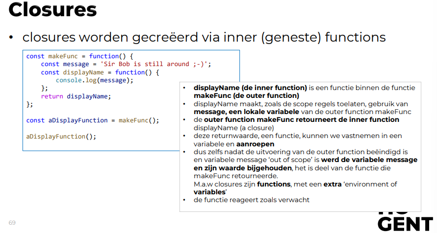

<h1>Objecten en functies</h1>

# Objecten

Object = verzameling van properties.

Property = naam (case sensitive string) en waarde (primitief datatype / object)

```javascript
// Aanmaken met object literal
const object1 = {
    naam: "Jelle",
    points: 20;
    verjaardag: {dag: 30, maand: "oktober", jaar: 1995}
}

// Shorthand voor wanneer je een variabele als key toevoegt en deze dezelfde naam heeft als de property;
const naam = "Jelle";
const points = 20;
const metShorthand = {naam, points}
const zonderShorthand = {naam: naam, points: points}


// Properties lezen
const metPuntNotatie = object1.points; // voorkeur (makkelijker te lezen)
const metArrayNotatie = object1["points"];
const onbestaandeProperty = object1["bestaatniet"] // = undefined
const chaining = object1.verjaardag.jaar;

// Property toevoegen of toewijzen
object1['lievelingsgerecht'] = "spaghetti";
object1.lustKoffie = true;

// Property verwijderen
delete object1['points'];
delete object1.naam;

// Alle properties overlopen
for (const key in object1) {
    let value = object1[key];
}
```

Objecten ondersteunen destructuring assignment.

```javascript
const avatar = {
    name: 'Bob',
    points: 20;
    gender: 'male'
};

// Zonder destructuring:
const naam = avatar.name;
const punten = avatar.points;
const geslacht = avatar.gender;

// Zelfde met destructuriong:
const {name: naam, points: punten, gender: geslacht} = avatar;
// Wanneer variabelen al gedeclareerd zijn moet je haakjes gebruiken
let naam, punten, geslacht;
({naam, punten, geslacht} = avatar)

const {pet: huisdier} = avatar // returnt undefined want avatar heeft geen property pet
```

Met JSON.parse() kan je een string omzetten naar een object.

# Scopes

Drie types scope:

- Global scope: variabele of functie kan overal binnen het script gebruikt worden.
- Local scope: Kan overal binnen dezelfde functie gebruikt worden.
- Block scope: Enkel zichtbaar binnen hetzelfde code block (deel tussen {})

JS gebruikt steeds de meest lokale variabele. Is er binnen de scope geen variabele met de opgegeven naam, zoekt het steeds in een hogere scope, tot het de globale scope bereikt.

# HTML DOM API

Interacties met HTML creëren events -> worden afgehandeld door event handlers (= callback functie)

Window-object heeft een document property -> bevat object-representaties van de HTML-pagina en zijn elementen. <br> HTML-attributen zijn weergegeven als properties.

Callback functie = functie die als argument gepast wordt naar andere code. <br> Conventie van naamgeving in JS: on + eventnaam.

Om event handlers juist te kunnen instellen moet de DOM eerst geladen zijn -> daarom script-element net voor body plaatsen in HTML.

_Alternatief: gebruik window.onload, dit wordt gecalld wanneer het volledige document, inclusief afbeeldingen geladen is._

Je kan ook eventHandlers instellen via .addEventListener(eventnaam, handler).

# Closures

Closure = functie die afhankelijk is van een value buiten de functie.

Ze worden gecreëerd via geneste functies => Als de outer function returnt, zijn sommige variabelen "weg". De closure neemt deze mee.



# Exceptions

Exceptions worden opgevangen met `try {} catch (error) {}`
