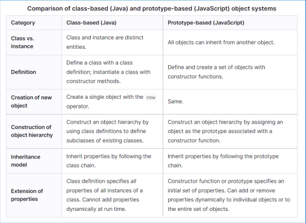

<h1>OOP in JavaScript</h1>

# Object orientation in JS

JS is gebaseerd op prototypes. Je gebruikt andere objecten als blueprint.

In ES6 bestaat er een alternatieve syntax die overeenkomt met die van class based talen (zoals Java)

Class based = Je maakt een skelet structuur en creëert daar instanties van <br>
Prototype Based = Je maakt een voorbeeldobject en creëert nieuwe instanties o.b.v. prototype chaining

# Class

Een klasse declareren:

```javascript
class ClassName {
    (static) fields

    constructor (params) {statements}

    (static) methods(params) {statements}

    get propertyNaam() {statements}
    set propertyNaam(waarde) {statements}
}

```

Declaraties worden niet gehoist, dus je moet eerst declareren voordat je kan gebruiken.

Kan ook via class expressions gebeuren (zoals functions)

```javascript
const ClassName = class {
  // inhoud van klasse
};
```

## Fields

Fields gedeclareerd zonder initialisatie = undefined.

Binnen de klasse altijd `this` keyword gebruiken om te verwijzen naar fields.

Fields zijn publc, om ze private te maken zet je er een hashtag voor. Je gebruikt dus geen access modifier zoals in Java.

Public fields hoeven niet expliciet gedeclareerd te worden, private fields wel.

Vroeger waren er geen private fields in JS -> ze werden aangegeven met \_ (behandel deze als private)

## Constructors en new

Instanties maken van een klasse `new ClassName()`

Keyword `constructor` om aan te geven dat de methode een constructor is

Geen constructor = impliciete parameterloze constructor.

Een klasse kan maar één constructor hebben (dus geen overloading)

## Getters/Setters

Getters zijn parameterloze functies die automatisch uitgevoerd worden telkens de property gelezen wordt.

Setters hebben exact 1 parameter en worden telkens uitgevoerd wanneer de property gewijzigd wordt.

Je kan ze private maken met een hashtag.

Elke property moet een andere naam hebben.

Getters/setters ook mogelijk in objects

Voordelen:

- Encapsulation.
- Interface van klasse isoleren tegen veranderingen (vb. werking aanpassen, maar methodenaam blijft hetzelfde)

Je hoeft nog geen getters/setters aan te maken voordat je ze nodig hebt, want ze krijgen dezelfde naam als het field dat ze vervangen.

## Andere methodes

`func` keyword is niet nodig.

Kunnen private gemaakt worden.

## Static members

Keyword `static` gebruiken.

Kunnen aangeroepen worden zonder instantie + kunnen niet aangeroepen worden via instantie.

Instance methodes worden gedefinieerd op het prototype, static methodes niet.

## Inheritance

Keyword `extends`

Single inheritance => maar 1 superklasse mogelijk

Subklasse heeft geen toegang tot private fields van superklassen.

Je kan methodes overriden. Om naar de superklasse te refereren kan je `super.method(params)` gebruiken.

In de constructor van een subklasse moet je altijd `super(params)` expliciet aanroepen. Dit moet gebeuren voordat je naar `this` verwezen hebt. Bij impliciete constructor, wordt `super(params)` automatisch toegevoegd.

## Object

Bovenaan de inheritance hiërarchie, als je niet van iets anders erft, erf je van Object.

# Prototypes

In JS is alles een object, klassen bestaan eigenlijk niet.

Objecten delen toestanden en gedrag via prototype objecten. Elk object heeft eigen properties en methodes. Een daarvan is \_proto\_ -> hier erft het object van.

Hieronder dezelfde klasse met de nieuwe syntax en de originele prototype-syntax.

Nieuwe syntax:

```javascript
class BlogEntry {
  constructor(body, date = new Date()) {
    this.body = body;
    this.date = date;
  }
}
```

Prototype syntax:

```javascript
function BlogEntry(body, date = new Date()) {
  this.body = body;
  this.date = date;
}

const blogEntryObj = new BlogEntry("Tekst voor de body");
```

blogEntryObj ziet er dan als volgt uit:

```javascript
{
  body: ("Tekst voor de body",
  date: SAT Apr 19 2026 15:36,
  __proto__: Object);
}
```

Prototype is met andere woorden ook een object en heeft een eigen prototype = **prototype chain**. Als een property / methode niet gevonden wordt op het prototype, wordt er gezocht in het prototype van het prototype tot Object.prototype bereikt wordt.

Je kan in de constructor een property op het prototype plaatsen, dan zullen alle instanties die gemaakt worden via die constructor de property delen.

```javascript
// Properties instellen
const blog1 = new BlogEntry("Hallo");
const blog2 = new BlogEntry("Vaarwel");
BlogEntry.prototype.language = "NL";
blog1.language; // NL
blog2.language; // NL
blog1.language = "EN";
blog1.language; // EN
blog2.language; // NL

// Functie aan alle objecten toevoegen.
BlogEntry.prototype.greet = function (naam) {
  return `Hallo ${naam}!`;
};
```


