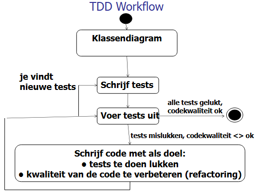

<h1 class="title"> 1. Test Driven Development </h1>

# Voordelen van TDD

- Je moet eerst nadenken over wat je van de code wil.
- Zorgt ervoor dat je het design gaandeweg kan aanpassen wanneer het porbleem duidelijker wordt.
- Snelle feedback loop
- Gedetailleerde specificatie van wat je software moet doen. (Testen gelden als documentatie.)
- Kortere reworktijd
- Makkelijker om bugs te vinden.
- Code wordt eenvoudiger -> je schrijft enkel code om de tests te doen slagen.

# Workflow



Belangrijk: Alle tests moeten falen voor de code geschreven is.

Tests eerst schrijven = vermijden om dezelfde denkfout twee keer te maken.

Moeilijk om een test te schrijven o.b.v. UML? => UML-ontwerp is verkeerd. Aanpassen.

Praktisch: Voor je de klasse implementeert -> Klasse aanmaken, UnsupportedOperationExceptions gooien in elke methode, testen uitschrijven.

# JUnit

## Test case

= klasse die tests bevat.

Is een POJO (dus geen extends of implements)

Normale flow:

- Testobject aanmaken
- Te testen methode aanroepen
- Uitvoer controleren

Tips voor test-methoden:

- Zo min mogelijke assertions (anders moeilijk leesbaar, kans op bugs in test is groter)
- Onafhankelijke tests
- Moeten in willekeurige volgorde kunnen getest worden

## Assertions - statische methoden

Geen nieuwe info, behalve extra argumenten bij gekende functies:

- assertEquals(expected, actual, String message) -> assertEquals met een message wanneer false
- assertEquals(expected, actual, delta) -> delta is een maximaal verschil. Enkel bruikbaar bij doubles en floats.

## Test fixture

= benaming voor resource die in meerdere testmethoden wordt gebruikt.

Altijd in @BeforeEach plaatsen en eventuele clean-up in @AfterEach.

Use case voor @BeforeAll: Test fixtures die niet gewijzigd worden en veel tijd vragen om te initialiseren.

## Wat zeker testen

### Algemeen

- Grenswaarden uit de realiteit (vb. gewicht 0kg)
- Niet toegelaten waarden uit realiteit (vb. -1kg)
- Niet toegelaten waarden omwille van technische redenen (vb. null)

### Collections

- Normale verzameling
- Verzameling met grenswaarden
- Verzameling met één element
- Lege verzameling
- null

### Strings

- Normale waarde
- Lege en blanco strings
- null
- te korte / lange strings
- vreemde tekens

## Parameterwaarden

Gebruiken via @ParameterizedTest. Naast bekende annotations bestaan ook:

- @CsvSource({"waarde1A,waarde2A", "waarde1B,waarde2B", ...}) -> voor meerdere parameters met primitieve datatypen. Je kan een delimiter instellen (vb. @CsvSource({"Jan|Peeters|Peeters, Jan}, delimiter= '|'")), nodig als de data kommagetallen bevat.
- @MethodSource("methodeNaam") -> gebruikt de returnwaarde van een methode als parameter
- @EnumSource(EnumKlasse.class) -> Test alle enum-constants
- @EnumSource(value = EnumKlasse.class, names={"CONSTANT_1", "CONSTANT_2"}) -> Test de opgegeven enum-constants

# Mockito

Stappenplan dependency vervangen door mock-object:

- Voorzie een attribuut voor de dependency
- Voorzie een manier om aan DI te doen (constructor of setter)
- Check dat er geen nieuwe dependency aangemaakt wordt in de te testen methode.

Het eerste deel van dit hoofdstuk gaat volledig over mocks injecteren (zelfde manier als in eigen projecten). Met Lombok kan je de injectie uitvoeren via de @AllArgsConstructor.

Als je de @Mock annotation gebruikt, kun je @InjectMocks gebruiken om alle mocks in dit object te injecteren.

```java
@Mock
private Manufacturer manufacturer;
@Mock
private CoasterModel model;

@InjectMocks
private Rollercoaster coaster; // manufacturer en model worden geïnjecteerd via 1. constructor of 2. setter als er geen constructor met de mocks als argument is. Werkt zoals @BeforeEach.
```

## Mocks verificeren

Met Mockito.lenient() kun je de stricte regels (vb. unnecessary stubbing) negeren.

```java
lenient().when(website.getUrl()).thenReturn("www.google.com"); // throwt niet als getUrl() nooit gecalld wordt.
```

Aantal keren aanroepen controleren -> verify(object, times(aantalKeer)).methode();

<style>
.title {
    font-size: 48px;
} 
</style>
