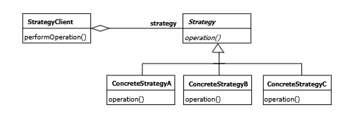
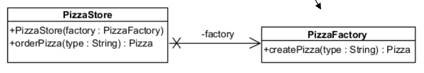
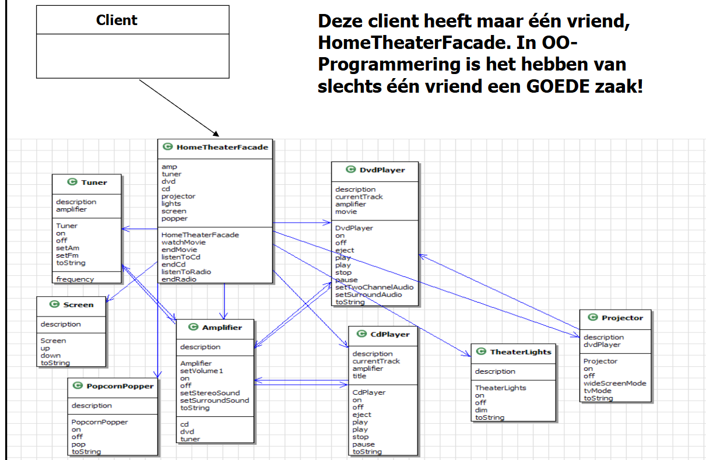
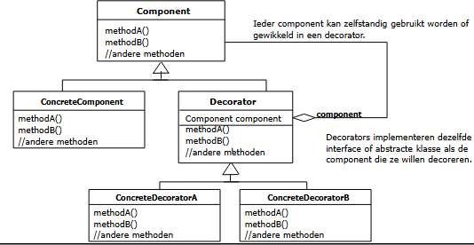
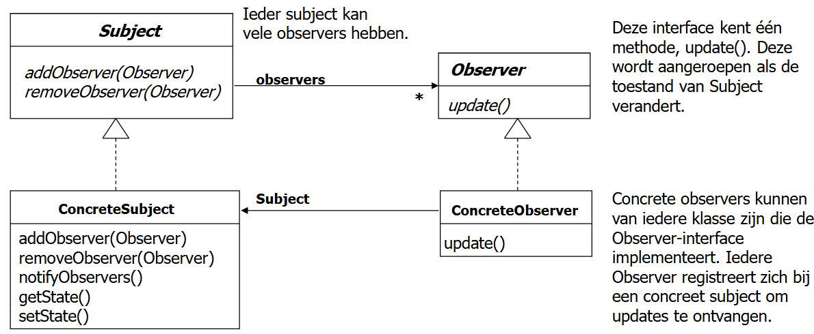
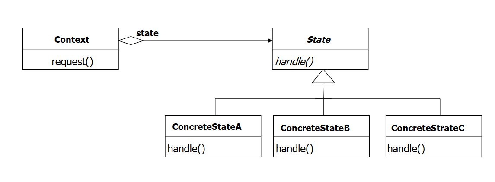

<h1> Deel 2 - Design Patterns </h1>

# Design patterns

## Strategy Pattern

> Door het gedrag te extracten, kan je dat gedrag flexibel aanpassen (ook bij runtime). Daarnaast wordt het gedrag ook herbruikbaar voor andere klassen.

### Stappenplan:

1. Maak een interface voor het gedrag aan (vb. FlyBehavior)
2. Voorzie instantievariabele en de nodige getters/setters in de client(super)klasse voor het gedrag.
3. Implementeer een methode in de clientklasse die via de instantievariabele het gedrag uitvoert.
4. Werk concrete implementaties van de gedragsinterface uit.
5. Laat subklassen het concrete gedrag in de superklasse setten.

### UML

## Simple Factory Pattern

> Door de creatielogica (die vaak moet aangepast worden) te extracten, kan je de code in de clientklasse gesloten maken voor verandering.

Stappenplan:

1. Creëer een nieuwe factoryklasse.
2. Stel een (meestal statische) methode beschikbaar die de concrete klassen gaat aanmaken.
3. Roep de factory method aan in de clientklasse.

Note: Je gebruikt de aangemaakte objecten vaak om operations op uit te voeren. Als het gereturnde object een null is, krijg je snel NPE's. -> Oplossing is om een concrete implementatie van het Product te voorzien dat voor "geen product" staat.

_Implementatie met functional programming_:

- Maak een `Map<Key, Supplier<Product>>` aan. Voeg de te maken producten toe aan de map in de constructor van de factory. (Meestal via een hulpmethode)

## Facade Pattern

> Vereenvoudigt de interface door de complexiteit van één of meerdere subsystemen achter een nieuwe verenigde interface te plaatsen.

Doordat die client klasse enkel in interactie gaat met de facade, i.p.v. met alle onderdelen van het subsysteem, krijg je minder dependencies.

### Stappenplan

1. Creëer een nieuwe klasse voor de facade.
2. Voeg de onderdelen van het subsysteem toe als attributen voor de facade.
3. Implementeer methoden die de onderdelen manipuleren.

### UML

## Decorator Pattern

> Nieuwe functionaliteiten toevoegen aan een bestaand object. Je kan a.d.h.v. dit pattern voldoen aan het open-closed principe.

### Stappenplan

1. Zorg dat er een interface (Component) is voor de klasse die gedecoreerd moet worden (ConcreteComponent).
2. Laat Decorator dezelfde interface / abstracte klasse implementeren.
3. Voeg in Decorator een attribuut toe waarin het een Component kan bijhouden.
4. Breid de functionaliteiten uit.

Geef de Component die omwikkeld wordt telkens aan de constructor van een concrete Decorator door.

### UML

## Observer Pattern

> Wanneer objecten op de hoogte moeten blijven van gebeurtenissen in andere objecten, zorgt het observer pattern ervoor dat ze loosely coupled blijven.

### Stappenplan

1. Maak een interface voor Subject en Observer.
2. Implementeer de interfaces.

=> Niet anders dan hoe ik het al doe.

### UML

## State Pattern

> Maakt het mogelijk om het interne gedrag te veranderen wanneer de toestand van een object verandert.

### Stappenplan

1. Verzamel alle toestanden.
2. Maak een abstracte klasse aan die de toestand voorstelt. Hou het object waarvoor de toestand geldt bij in een protected variabele.
3. Maak een attribuut aan in het object waarmee je de huidige toestand bijhoudt.
4. Verzamel alle acties en maak voor elke actie een methode in de abstracte klasse.
5. Maak voor elke toestand een concrete klasse die erft van de abstracte klasse. Geef het object waarvoor de toestand geldt mee in de constructor.
6. Laat de methodes van het object delegeren naar de methodes in zijn current state.

### UML

# MVC-architectuur

Design patterns in MVC:

- Controller werkt als facade voor de view -> Model wordt verborgen.
- Controller werkt als strategy voor de view -> Controller kan vervangen worden.
- Model is een subject en views en controllers zijn hier observers voor.
- De view is een composite.
