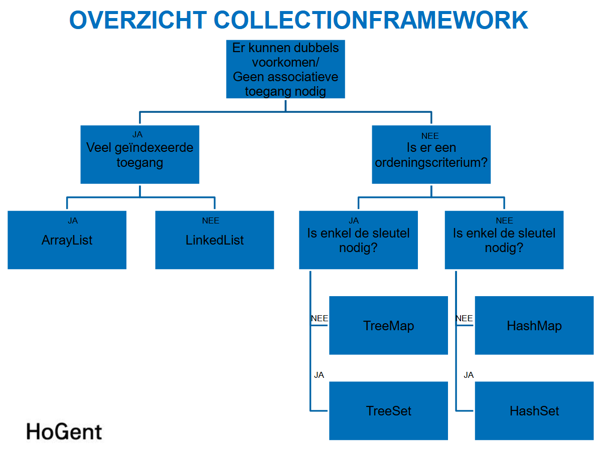
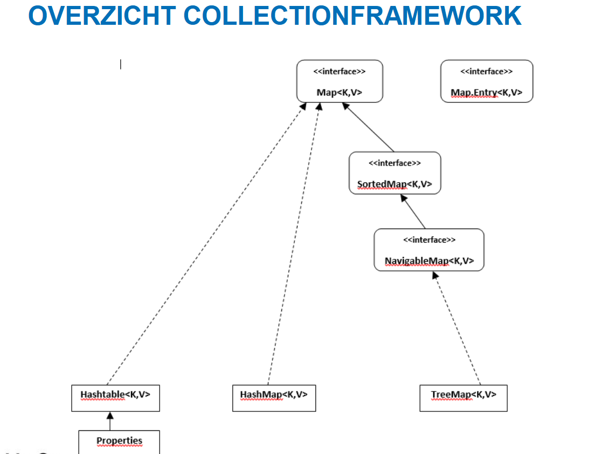

<h1> Deel 3 - Java </h1>

# Collections

Dingen vergeten uit het eerste jaar:

```java
// Eén property reversen in Comparator (Comparator.reverseOrder())
Collections.sort(reductiebonLijst, Comparator.comparing(Reductiebon::getPercentage)
.thenComparing(Reductiebon::getReductiebonCode, Comparator.reverseOrder()));

// Verwijderen als een bepaalde conditie true is:
lijst.removeIf(element -> element.getter() == value);

// Bewerkingen in streams:
lijst.stream().average();
```



## Maps

`keySet()`, `values()` en `entrySet()` zijn views van de oorspronkelijke Map -> veranderingen in deze sets worden ook in de originele Map doorgevoerd.



Implementaties:

- HashMap -> elementen opgeslagen in hash-tabel
- HashTable -> verouderde versie van HashMap (NPE als sleutel of value null is)
- TreeMap -> elementen gesorteerd opgeslagen in boomstructuur (gebruikt natuurlijke volgorde of Comparator)

```java
// Van Collection naar Map
Collectors.toMap(key, value);
Collectors.toMap(key, value, (key1, key2) -> key1);
Collectors.toMap(key, value, (key1, key2) -> key1, TreeMap::new);

Collectors.groupingBy(key);
Collectors.groupingBy(key, value);
Collectors.groupingBy(key, TreeMap::new, value);

```

### Map interface

Belangrijkste methoden die ik nog niet veel gebruik:

```java
map.clear();
map.putAll(Map<? extends Key, ? extends Value> m);
map.remove(Object key) // verwijdert de key, returnt ook de value

entry.setValue();
```

### HashMap

Java gebruikt hash buckets om de key-value pairs op te slaan.

- Capaciteit -> aantal buckets dat de HashMap heeft. (wordt verhoogd via `.rehash()`)
- Laadfactor -> Hoe vol de HashMap kan zijn voor de capaciteit verhoogd wordt. (default = 0.75 = 75%)

Een lege constructor zet de capacity op 16 en load factor op 0.75. Je kan ook een Map meegeven aan de constructor om een kopie van een andere Map te maken.

## Synchronisatie

De klassen in het Collection framework zijn unsynchronized. Je kan wrapperklassen gebruiken om ze om te zetten tot synchronized versies -> deze zijn thread-safe.

vb. `Collections.synchronizedList(existingList);`

## Unmodifiable

Je kan de klassen ook wrappen met een Unmodifiable wrapper klasse -> ze throwen dan UnsupportedOperationExceptions als je de lijst probeert aan te passen.

vb. `Collections.unmodifiableList(existingList);`

## Abstract collections

Dienen als abstracte implementaties van de interfaces die als basis voor een zelfgemaakte collection implementatie kunnen dienen.

vb. AbstractCollection, AbstractList, AbstractMap, AbstractSequentialList, AbstractSet
